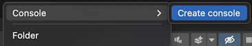
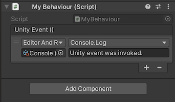

# Unity Console
Unity3d package allowing the toggling of console output and debugging of UnityEvents.

Feedback is welcome.

## Plug and Play
1. Open "Package Manager"
2. Choose "Add package from git URL..."
3. Use the HTTPS URL of this repository:
   `https://github.com/yanicksenn/unity-console.git#1.0.0`
4. Click "Add"

## Usage
- [Console](#user-content-console)
- [Logging](#user-content-logging)
- [Toggling](#user-content-toggling)

### Console

A console can be created through the asset menu > Create > Console > ... .



### Logging

You can inject a console throught the inspector into your script.

Is is possible to use lazy logging or normal logging, although it is recommended to always use lazy logging inside of a script.

| Lazy logging             | Normal logging |
|--------------------------|----------------|
| `LazyLog(() => ...)`     | `Log(...)`     |
| `LazyWarning(() => ...)` | `Warning(...)` |
| `LazyError(() => ...)`   | `Error(...)`   |

```c#
public class MyBehaviour : MonoBehaviour
{
    public Console console;
    
    private Start()
    {
        console?.LazyLog(() => "Hello, World!");
    }
}
```

Normal logging is recommended through a unity event.

```c#
public class MyBehaviour : MonoBehaviour
{
    public UnityEvent unityEvent = new UnityEvent();
    
    private Awake()
    {
        unityEvent.Invoke();
    }
}
```



After the untiy event was invoked the following output will appear in the editor console.


### Toggling

No messages will be printed to the console when it is set to inactive.


_Active console_


_Inactive console_

Lazy logging ensures that no messages are generated while normal logging always generates a message but will only print it when the console is active.
